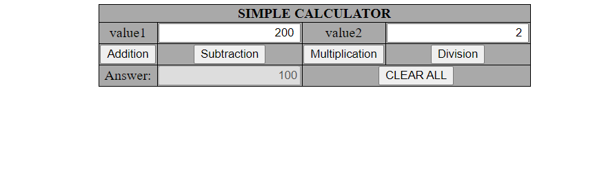

## Program 1

### 	Write a JavaScript to design a simple calculator to perform the following operations: sum, product, difference and quotient.

## Outputs

## Addition

## Subtraction

## Multiplication

## Division
