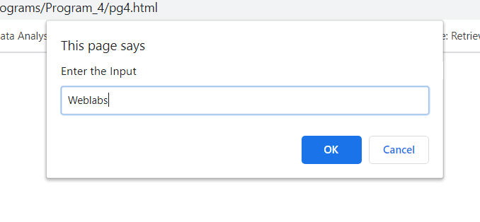
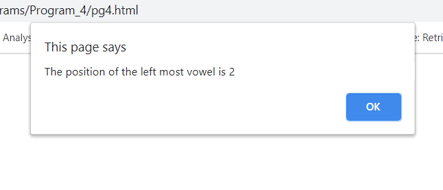
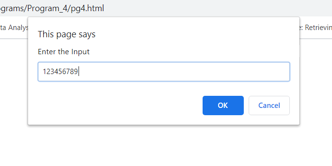
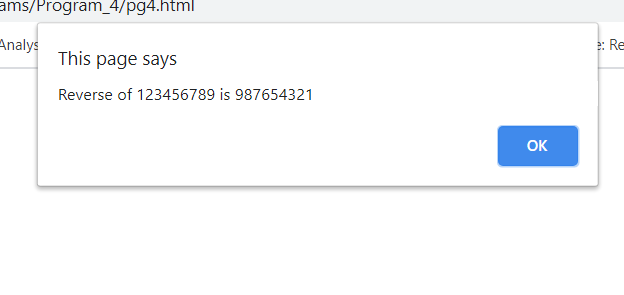

## Program 4
###  Develop and demonstrate a HTML5 file that includes JavaScript script that uses functions for the following problems:
### a.	Parameter: A string 
### b.	Output: The position in the string of the left-most 
### c.	Parameter: A number 
### d.	Output: The number with its digits in the reverse order

## Outputs

