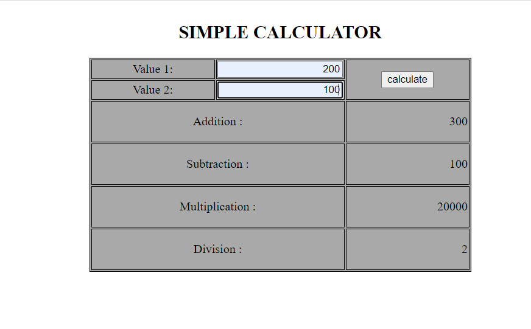
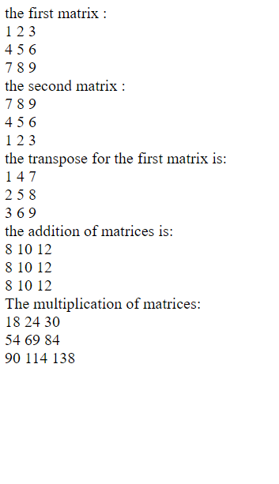

## Program 8a and 8b

### 8.	Write the PHP programs to do the following:
### a.	Implement simple calculator operations.
### b.	Find the transpose of a matrix.
### c.	Multiplication of two matrices.
### d.	Addition of two matrices.

## Output

